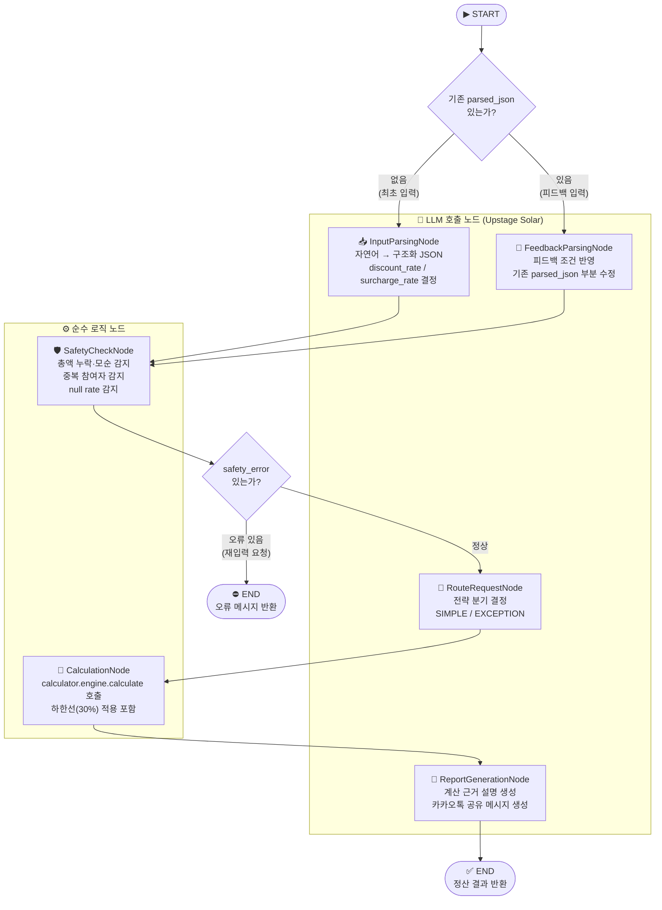
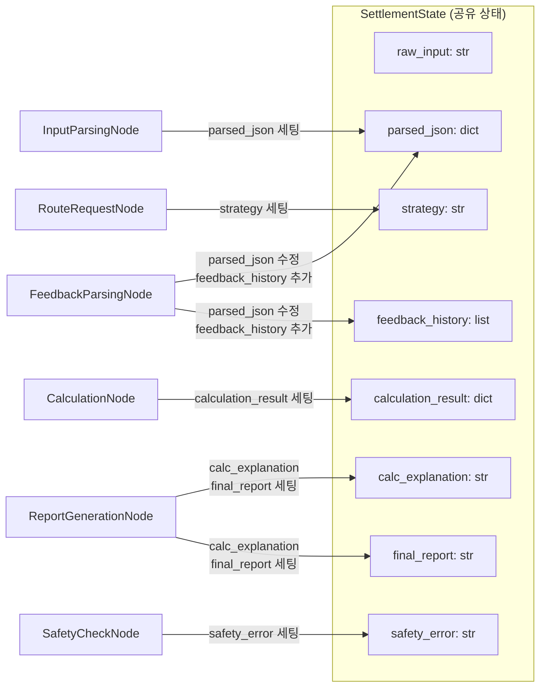

# AI 정산 비서 — LangGraph Agent 워크플로우 구조도

## 전체 흐름

---

## State 흐름 (SettlementState)

---

## 노드별 역할 요약

| 노드 | LLM | 입력 | 출력 |
|------|-----|------|------|
| **InputParsingNode** | ✅ Upstage Solar | `raw_input` (자연어) | `parsed_json` (구조화 JSON + rate) |
| **SafetyCheckNode** | ❌ 순수 Python | `parsed_json` | `safety_error` (오류 시 문자열) |
| **RouteRequestNode** | ✅ Upstage Solar | `raw_input` + `parsed_json` | `strategy` (SIMPLE / EXCEPTION) |
| **CalculationNode** | ❌ calculator/ 호출 | `parsed_json` | `calculation_result` (최종 금액) |
| **ReportGenerationNode** | ✅ Upstage Solar | `calculation_result` + `raw_input` | `calc_explanation` + `final_report` |
| **FeedbackParsingNode** | ✅ Upstage Solar | `raw_input` + `parsed_json` + `feedback_history` | `parsed_json` (수정됨) |

---

## 설계 원칙

- **LLM 담당**: 자연어 파싱, rate 결정(0.0~1.0), 전략 분기, 설명 생성
- **calculator/ 담당**: rate → 실제 금액 환산, 30% 하한선 적용, 총액 검증
- **피드백 루프**: `FeedbackParsingNode` → `SafetyCheckNode` → `RouteRequestNode` → `CalculationNode` → `ReportGenerationNode`
- **HTTP 통신 없음**: `front/` → `ai/` → `calculator/` 순서로 직접 import 호출
